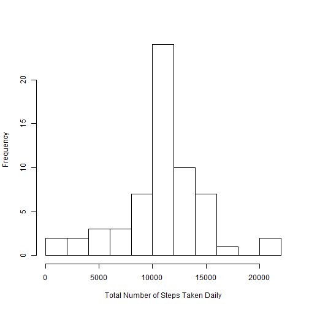

## Loading and pre-processing the data

First step is to read the activity data from the downloaded activity csv file. The data contains three variables, variable **steps** containing the number of steps taken on the date specified in the varaible **date** during the 5-minute interval specified in variable **interval**. As a pre-processing step, convert the date value to be of type *date* and interval value to be of type *numeric*.

```r
ActData<-read.table("activity.csv", header=TRUE, sep=",")
ActData$date<-as.Date(ActData$date)
ActData$interval<-as.numeric(ActData$interval)
str(ActData)
```

```
## 'data.frame':	17568 obs. of  3 variables:
##  $ steps   : int  NA NA NA NA NA NA NA NA NA NA ...
##  $ date    : Date, format: "2012-10-01" "2012-10-01" ...
##  $ interval: num  0 5 10 15 20 25 30 35 40 45 ...
```
A total of 17568 rows has been read in from the raw activty file.

## Mean total number of steps taken daily
To proceed further with the analysis, measurements where **steps** variable has missing values are omitted.

```r
ActDataRmvsNa<-na.omit(ActData)
str(ActDataRmvsNa)
```

```
## 'data.frame':	15264 obs. of  3 variables:
##  $ steps   : int  0 0 0 0 0 0 0 0 0 0 ...
##  $ date    : Date, format: "2012-10-02" "2012-10-02" ...
##  $ interval: num  0 5 10 15 20 25 30 35 40 45 ...
##  - attr(*, "na.action")=Class 'omit'  Named int [1:2304] 1 2 3 4 5 6 7 8 9 10 ...
##   .. ..- attr(*, "names")= chr [1:2304] "1" "2" "3" "4" ...
```
A total of 2304 having missing values have now been omitted.
To analyse total number of steps taken daily, activity data (with removed missing values) is aggregated by date, applying sum function on the variable **steps** to derive the total number of steps taken on that day using the function *tapply* as shown below. Then a data frame **DlyActData** is created specifying the date in the variable **Date** and total number of steps in the variable **Steps**.

```r
DlyActData<-tapply(ActDataRmvsNa$steps, ActDataRmvsNa$date,sum)
DlyActData<-data.frame(Date=as.Date(names(DlyActData)), Steps=c(DlyActData))
str(DlyActData)
```

```
## 'data.frame':	53 obs. of  2 variables:
##  $ Date : Date, format: "2012-10-02" "2012-10-03" ...
##  $ Steps: int  126 11352 12116 13294 15420 11015 12811 9900 10304 17382 ...
```
Now a histogram is plotted to understand the frequency pattern of total number of steps taken each day using the *base plotting function hist*


```r
hist(DlyActData$Steps,main=" ", breaks=10, xlab="Total Number of Steps Taken Daily")
```


                                                                      
Then mean total number of steps taken daily is computed as shown below

```r
mean(DlyActData$Steps)
```

```
## [1] 10766.19
```

Then median total number of steps taken daily is computed as shown below

```r
median(DlyActData$Steps)
```

```
## [1] 10765
```
## Average Daily Activity Pattern
To analyse average daily activity pattern, activity data (with removed missing values) is aggregated by interval, applying mean function on the variable **steps** to derive the total number of steps taken in a specific interval averaged across all days using the function *tapply* as shown below. Then a data frame **AvgActData** is created specifying the interval in the variable **Interval** and number of steps in the variable **Steps**.

```r
AvgActData<-tapply(ActDataRmvsNa$steps, ActDataRmvsNa$interval,mean)
AvgActData<-data.frame(Steps=c(AvgActData), Interval=as.numeric(names(AvgActData)))
str(AvgActData)
```

```
## 'data.frame':	288 obs. of  2 variables:
##  $ Steps   : num  1.717 0.3396 0.1321 0.1509 0.0755 ...
##  $ Interval: num  0 5 10 15 20 25 30 35 40 45 ...
```
Now a time series line plot is created to understand the pattern of number of steps taken in each interval averaged across all days using the *ggplot function from ggplot2 package* as shown below.

```r
library(ggplot2)
g<-ggplot(AvgActData,aes(Interval,Steps))
g+geom_line()+labs(title="Number steps taken during a specific interval averaged across all days",x="5-minute time interval",y="Average number of steps taken")
```


Interval in which the maximum number of steps are taken druing the day along with the count of steps is caculated as shown below

```r
AvgActData[which.max(AvgActData$Steps),]
```

```
##        Steps Interval
## 835 206.1698      835
```

## Imputing missing values
All the analysis done with respect to comparison of steps taken each day and during each interval so far, has been done via omitting missing values. Let us analyse the impact on the analysis via considering those measurements with missing values imputed using some mechanism. Let us begin with finding out the total number of missing values in the raw activity data.

```r
nrow(ActData[is.na(ActData$steps),])
```

```
## [1] 2304
```
So the raw activity data has 13.1147541% of missing values. Let us impute the missing values with number of steps taken during the sepcific interval averaged across all days. The same can be achieved by merging the raw activity data **ActData** with average activity data **AvgActData** using the variable interval as shown below. A data frame **ImptdData** is created with **steps** variable having missing values replaced with average number of steps taken during the sepcific interval.

```r
ImptdData<-merge(ActData,AvgActData, by.x="interval",by.y="Interval",all=TRUE)
ImptdData$steps[is.na(ImptdData$steps)]<-ImptdData$Steps[is.na(ImptdData$steps)]
str(ImptdData)
```

```
## 'data.frame':	17568 obs. of  4 variables:
##  $ interval: num  0 0 0 0 0 0 0 0 0 0 ...
##  $ steps   : num  1.72 0 0 0 0 ...
##  $ date    : Date, format: "2012-10-01" "2012-11-23" ...
##  $ Steps   : num  1.72 1.72 1.72 1.72 1.72 ...
```
Now that we have imputed the missing values let us re perform the analysis with respect to the total number of steps taken daily and analyse the findings.
To analyse total number of steps taken daily, activity data (with missing values imputed) is aggregated by date, applying sum function on the variable **steps** to derive the total number of steps taken on that day using *tapply* function as shown below. Then a data frame **NonMsngDlyActData** is created specifying the date in the variable **Date** and total number of steps in the variable **Steps**.

```r
NonMsngDlyActData<-tapply(ImptdData$steps, ImptdData$date,sum)
NonMsngDlyActData<-data.frame(Date=as.Date(names(NonMsngDlyActData)), Steps=c(NonMsngDlyActData))
str(NonMsngDlyActData)
```

```
## 'data.frame':	61 obs. of  2 variables:
##  $ Date : Date, format: "2012-10-01" "2012-10-02" ...
##  $ Steps: num  10766 126 11352 12116 13294 ...
```
Now a histogram is plotted to understand the frequency pattern of total number of steps taken each day using the *base plotting function hist*

```r
hist(NonMsngDlyActData$Steps,main=" ", breaks=10, xlab="Total Number of Steps Taken Daily")
```


                                                                          
Comparing the histogram created with imputed missing values we see that the frquency count of total daily steps in the range of 10000 to 12000 have increased from aroung 16 earlier to greater than 20 now.
Then mean total number of steps taken daily with imputed misssing values is computed as shown below

```r
mean(NonMsngDlyActData$Steps)
```

```
## [1] 10766.19
```

Then median total number of steps taken daily with imputed missing values is computed as shown below

```r
median(NonMsngDlyActData$Steps)
```

```
## [1] 10766.19
```
The mean and median total daily values are nearly the same as before when computed with missing values removed.

## Differences in activity patterns between weekdays / weekends
We continue to use the data with imputed missing values for this analysis. Let us begin with adding a new variable called **Day** to the data frame **ImptdData** such that it takes a value **weekend** if the day of the date is either a Saturday or Sunday and a value **weekday** otherwise.


```r
ImptdData$Day<-ifelse( weekdays(ImptdData$date)%in% c("Saturday","Sunday"), "weekend", "weekday")
str(ImptdData)
```

```
## 'data.frame':	17568 obs. of  5 variables:
##  $ interval: num  0 0 0 0 0 0 0 0 0 0 ...
##  $ steps   : num  1.72 0 0 0 0 ...
##  $ date    : Date, format: "2012-10-01" "2012-11-23" ...
##  $ Steps   : num  1.72 1.72 1.72 1.72 1.72 ...
##  $ Day     : chr  "weekday" "weekday" "weekend" "weekday" ...
```
Let us now group the data by two variables **Day** followed by **interval**. using function *goup_by from dplyr package*. Once the groups are created let us compute the average number of steps by applying *mean function using summarize* on **steps** variable. A data frame **NonMsngAvgActData** is created having variables **Day** indicating weekend / weekday, **Interval** indicating interval of the day, **Steps** containing average number of steps for the given interval.

```r
library(dplyr)
NonMsngAvgActData<-group_by(ImptdData, Day, interval)
NonMsngAvgActData<-summarize(NonMsngAvgActData, AvgSteps=mean(steps))
NonMsngAvgActData<-data.frame(Steps=c(NonMsngAvgActData$AvgSteps), Day=c(NonMsngAvgActData$Day), Interval=as.numeric(c(NonMsngAvgActData$interval)))
str(NonMsngAvgActData)
```

```
## 'data.frame':	576 obs. of  3 variables:
##  $ Steps   : num  2.251 0.445 0.173 0.198 0.099 ...
##  $ Day     : Factor w/ 2 levels "weekday","weekend": 1 1 1 1 1 1 1 1 1 1 ...
##  $ Interval: num  0 5 10 15 20 25 30 35 40 45 ...
```
Now a time series line plot with two panels, one each for weekday and weekend, showing the pattern of number of steps taken in each interval averaged across all days for weekday / weekend respectively, is created to undrstand the difference.

```r
g<-ggplot(NonMsngAvgActData,aes(Interval,Steps))
g+geom_line()+facet_grid(Day~.)+labs(title="Number steps taken during on weekday/weekend in a specific interval averaged across all days",x="5-minute time interval",y="Average number of steps taken")
```


